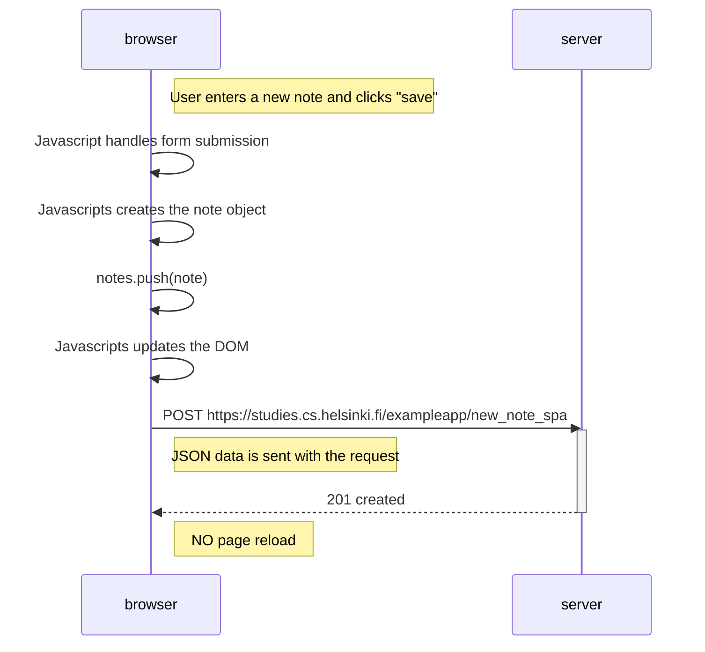

```mermaid 

sequenceDiagram
        participant browser 
        participant server

Note right of browser: User enters a new note and clicks "save"
        
        browser->>browser:Javascript handles form submission
        browser->>browser:Javascripts creates the note object 
        browser->>browser:notes.push(note)
        browser->>browser:Javascripts updates the DOM

        browser->>server: POST https://studies.cs.helsinki.fi/exampleapp/new_note_spa
        activate server 
Note right of browser: JSON data is sent with the request 
        server-->>browser: 201 created 
        deactivate server 
        
Note right of browser: NO page reload 
```